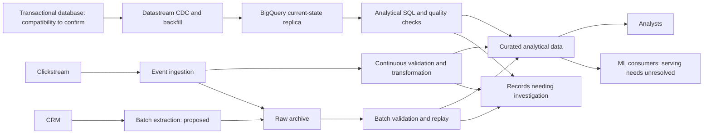

# Architecture working draft

Status: initial logical design. GCP service mapping and operational details remain to be justified with the candidate. This is not the final submission diagram.

## Purpose

Make e-commerce data usable for analytical queries and machine learning consumers. Preserve the distinction between a record arriving quickly and that record being correct.

## Logical data routes

The arrows describe responsibilities, not atomic delivery guarantees. Raw archiving, analytical writes, reconciliation, and replay safety need explicit designs.

### Transactional ingestion

Use CDC for order changes. The working GCP route is Datastream directly into a BigQuery replica, followed by analytical SQL. This avoids an unnecessary Pub/Sub/Dataflow hop for replication. The direct route does not populate the raw archive shown for the other sources; merge mode represents current source state, including updates and deletes. See [Decision 003](decisions/003-order-cdc.md) for compatibility assumptions and the history trade-off.

### Accepted reporting boundary

Historical regional spending uses the region recorded on the order, without a CRM join. CRM can support separate enrichment and customer reports, but a customer move must not reassign earlier orders in this metric. See [Decision 002](decisions/002-order-region-attribution.md) and the [attribution SQL](../sql/order_region_attribution.sql). Missing order regions remain quality issues; current CRM data is not a fallback.

## Decisions in progress

1. [Choose freshness by source](decisions/001-source-freshness.md): proposed; this determines the shape of the ingestion routes.
2. [Order CDC](decisions/003-order-cdc.md): accepted; Datastream direct to BigQuery is the working route pending source compatibility checks.
3. Buffering and ingestion service selection: pending.
4. Transformation placement and service selection: pending.
5. Raw storage, warehouse structure, and replay: pending.
6. Scheduling and orchestration: pending.
7. Identity, privacy, monitoring, recovery, and cost controls: pending.

Use the [requirements checklist](assessment-requirements.md) to ensure the finished diagram and explanation cover the assessment. Exact latency, region, scale, retention, and recovery assumptions have not been selected.
