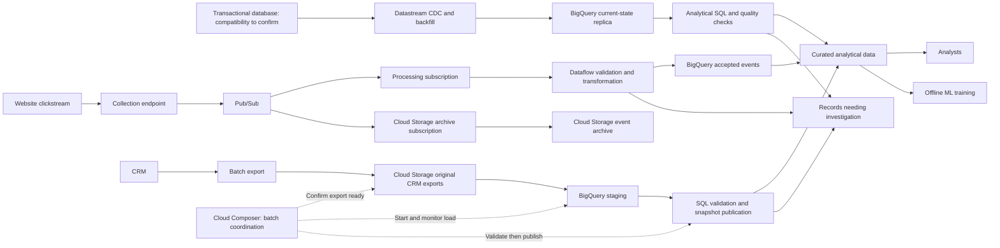

# Architecture working draft

Status: initial logical design. GCP service mapping and operational details remain to be justified with the candidate. This is not the final submission diagram.

## Purpose

Make e-commerce data usable for analytical queries and machine learning consumers. Preserve the distinction between a record arriving quickly and that record being correct.

## Logical data routes

The arrows describe responsibilities, not atomic delivery guarantees. Raw archiving, analytical writes, reconciliation, and replay safety need explicit designs.

Solid arrows represent data movement. Composer's labelled dotted arrows represent control of batch tasks. All routes describe the proposed platform; none have been deployed.

### Transactional ingestion

Use CDC for order changes. The working GCP route is Datastream directly into a BigQuery replica, followed by analytical SQL. This avoids an unnecessary Pub/Sub/Dataflow hop for replication. The direct route does not populate the raw archive shown for the other sources; merge mode represents current source state, including updates and deletes. See [Decision 003](decisions/003-order-cdc.md) for compatibility assumptions and the history trade-off.

### Accepted reporting boundary

Historical regional spending uses the region recorded on the order, without a CRM join. CRM can support separate enrichment and customer reports, but a customer move must not reassign earlier orders in this metric. See [Decision 002](decisions/002-order-region-attribution.md) and the [attribution SQL](../sql/order_region_attribution.sql). Missing order regions remain quality issues; current CRM data is not a fallback.

### Clickstream ingestion

Use a collection endpoint, Pub/Sub, and Dataflow to validate and transform website events before writing accepted records to BigQuery. Known invalid events go to a separate restricted output with reasons. The endpoint's hosting and the event schema remain unspecified. Dataflow provides custom processing at the cost of another running service; direct Pub/Sub-to-BigQuery delivery is the simpler alternative if processing needs are modest. See [Decision 004](decisions/004-clickstream-ingestion.md).

### CRM batch ingestion

Retain each original CRM export in restricted Cloud Storage, load it into isolated BigQuery staging, and validate with SQL before publishing reporting data. The working assumption is a complete snapshot; a failed export leaves the last good report available with its original source timestamp. Reruns must not duplicate rows or replace current data with an older snapshot. Export cadence and retention remain open. See [Decision 005](decisions/005-crm-batch.md).

### Batch orchestration

Cloud Composer coordinates export readiness, staging loads, validation, and publication, including safe reruns of retained CRM exports. It controls jobs rather than processing individual events. Workflows with Cloud Scheduler is the simpler alternative if the platform only needs this short sequence. Part 2 remains a manual Python run with no Composer environment. See [Decision 006](decisions/006-batch-orchestration.md).

## Decisions in progress

1. [Choose freshness by source](decisions/001-source-freshness.md): mixed approach accepted; numerical freshness targets remain open.
2. [Order CDC](decisions/003-order-cdc.md): accepted; Datastream direct to BigQuery is the working route pending source compatibility checks.
3. [Clickstream ingestion](decisions/004-clickstream-ingestion.md): accepted; collection endpoint → Pub/Sub → Dataflow → BigQuery.
4. Transformation placement: Dataflow for clickstream, SQL after order replication and CRM staging; detailed rules pending.
5. [CRM batch ingestion](decisions/005-crm-batch.md): accepted; Cloud Storage → BigQuery staging → SQL. Clickstream archives use a separate Cloud Storage subscription; retention, table design, and replay implementation remain open.
6. [Batch orchestration](decisions/006-batch-orchestration.md): Composer selected for the platform design; schedule and retry values open. No Composer deployment for Part 2.
7. [Operating controls](operations.md): scoped identities, curated read access, freshness/error monitoring, source-specific recovery, and cost controls. Exact operational values remain open.

Use the [requirements checklist](assessment-requirements.md) to ensure the finished diagram and explanation cover the assessment. Exact latency, region, scale, retention, and recovery assumptions have not been selected.
