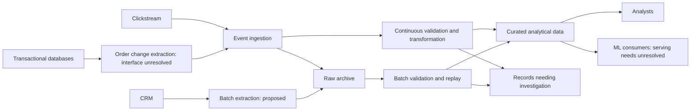

# Architecture working draft

Status: initial logical design. GCP service mapping and operational details remain to be justified with the candidate. This is not the final submission diagram.

## Purpose

Make e-commerce data usable for analytical queries and machine learning consumers. Preserve the distinction between a record arriving quickly and that record being correct.

## Logical data routes

The arrows describe responsibilities, not atomic delivery guarantees. Raw archiving, analytical writes, reconciliation, and replay safety need explicit designs.

## Decisions in progress

1. [Choose freshness by source](decisions/001-source-freshness.md): proposed; this determines the shape of the ingestion routes.
2. Reliable source extraction: next, after the source-level approach is discussed.
3. Buffering and ingestion service selection: pending.
4. Transformation placement and service selection: pending.
5. Raw storage, warehouse structure, and replay: pending.
6. Scheduling and orchestration: pending.
7. Identity, privacy, monitoring, recovery, and cost controls: pending.

Use the [requirements checklist](assessment-requirements.md) to ensure the finished diagram and explanation cover the assessment. Exact latency, region, scale, retention, and recovery assumptions have not been selected.
