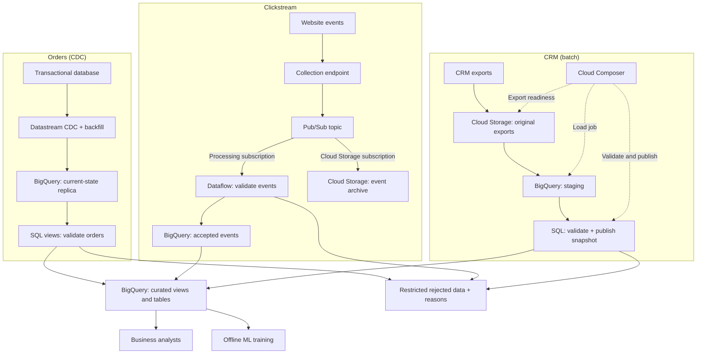

# GCP e-commerce analytics architecture

Part 1 submission — 14 September 2026.

Use continuous ingestion for transactional changes and website events, with batch CRM exports where consumers can tolerate their age. Keep source replication, validation and reporting separate so fresh data is not mistaken for correct data. BigQuery provides the analytical query layer; retained files support investigation and replay where available.

This is the platform design. The [Part 2 dev batch](cloud-verification.md) proves Python cleaning, accepted-file upload, BigQuery loading and spending queries. A separate [synthetic cloud demonstration](platform-verification.md) verifies CDC changes, streaming validation, CRM publication and orchestration. Production performance and recovery remain untested.

## Requirements confirmed by the assessment

- Ingest transactional database, clickstream and CRM data for e-commerce analytics.
- Process data in real time and consider batch processing, storage and querying.
- Make results available to business analysts and machine learning consumers.
- Include services such as Pub/Sub, Dataflow, BigQuery, Cloud Storage and Cloud Composer, with justified roles.
- Explain scalability, cost, security and trade-offs. Infrastructure as code is optional but preferred.

The brief does **not** specify a numerical latency target, workload size, source technology, retention period, budget or recovery objective. The following choices are our assessment design, not additional requirements attributed to the employer.

## Final high-level diagram

**Legend:** solid arrows show data movement or query dependencies; dotted arrows show orchestration. Boxes inside each group remain separate resources and access scopes. Rejected-data outputs are logical destinations, not one shared public store. Monitoring, IAM and retention apply across the diagram and are described below. The diagram does not promise atomic writes between the archive and analytical outputs.

[Open the standalone diagram](architecture.svg).

## Why each route exists

### Orders: CDC directly into BigQuery

Datastream performs an initial backfill followed by ongoing database changes. A separate BigQuery replica preserves source structure; curated SQL views apply agreed validity rules when queried. Views avoid adding a scheduled wait to the reporting path, but query cost and CDC staleness still need measurement. Materialise expensive transformations only when their cost and acceptable refresh delay justify it.

Use merge mode with a stable supported primary key. It reflects current source state, including updates and deletes; it is **not an immutable order history**. If the business needs an audit trail, retain change events through an appropriate append-only or archival design. Confirm database compatibility, networking and log retention before implementing CDC. Datastream's documented [BigQuery write modes](https://docs.cloud.google.com/datastream/docs/configure-bigquery-destination) support this distinction.

This route avoids adding Pub/Sub and Dataflow purely to move database rows. If the requirement is instead a business event such as payment completion, application events with reliable publication may be more appropriate than interpreting row changes. See [Decision 003](decisions/003-order-cdc.md).

### Clickstream: buffered events with custom validation

A server-side collection endpoint validates request size/basic structure and publishes to Pub/Sub before acknowledging acceptance. Browser clients do not receive cloud credentials. Prefer an existing application backend for collection if suitable; a new hosting service is not assumed.

A processing subscription supplies Dataflow for event validation, supported conversions and rejected-record routing. Accepted events land in BigQuery and feed curated views. Pub/Sub buffers temporary processing delays; Dataflow provides a place for custom processing. Both add operating responsibilities. If the agreed transformations are simple enough, direct Pub/Sub-to-BigQuery delivery is the cheaper, simpler alternative to reconsider. No session windows or enrichment joins are added without a use case.

A separate [Cloud Storage subscription](https://docs.cloud.google.com/pubsub/docs/cloudstorage) archives published events independently of Dataflow. This avoids writing a custom archive consumer, but the archive and reporting writes can succeed or fail independently. Monitor and reconcile both; archiving does not itself make replay safe. Preserve a stable event ID across producer retries, and agree duplicate handling and its retention horizon before enabling replay. See [Decision 004](decisions/004-clickstream-ingestion.md).

### CRM: retain, stage, validate, then publish

Land identifiable original exports in Cloud Storage, recording export ID, source snapshot time and load time. Load each complete snapshot into isolated BigQuery staging. Check identifiers, duplicates, required fields and completeness before publishing it as a whole. A failed or incomplete export leaves the last good report available with its original freshness timestamp.

Reprocessing the same export replaces its staged result; it must not append customers again. An older replay must not replace a newer published snapshot. If the source supplies incremental changes, replacement is unsuitable: use keyed merges with update ordering and explicit deletion handling instead. Retaining files costs storage but provides evidence and independent replay; direct loading is an alternative if the connector already provides that capability. See [Decision 005](decisions/005-crm-batch.md).

Cloud Composer coordinates export readiness, staging loads, validation and publication. It manages job dependencies and bounded retries; it does not carry events or periodically restart continuous CDC. Its environment cost is justified only if the platform has sufficient batch dependencies and reruns. For this short sequence alone, Workflows with Cloud Scheduler is a simpler alternative. This follows Google's [orchestration comparison](https://docs.cloud.google.com/workflows/docs/choose-orchestration); see [Decision 006](decisions/006-batch-orchestration.md).

## Reporting meaning and data quality

Analysts and offline ML consumers use curated BigQuery views/tables, rather than unrestricted source replicas or raw exports. Online feature serving is outside the chosen scope. Training data that requires historical customer attributes would need dated history and point-in-time joins to avoid using information learned after the prediction date.

Historical regional spending uses **OrderRegion recorded on the order**, without a current-CRM join. A customer moving later therefore does not reassign an earlier order to a different region. Other reports may legitimately use current CRM attributes, but their freshness must be exposed. See [Decision 002](decisions/002-order-region-attribution.md).

Missing facts are not invented to improve acceptance rates. Separate invalid records with source identity and reasons, reconcile input/accepted/rejected counts, and request evidence-based source corrections. Processing failures are retried or alerted; they must not be silently counted as rejected business data. Report coverage as well as job success. For CRM, a failed completeness check blocks snapshot publication; for event/order reporting, approved record-level exclusions must remain visible in quality counts.

Part 2 demonstrates this policy on the supplied sample: six accepted orders, four quarantined locally, and an unsent source-fix draft. Its unit-price interpretation of OrderAmount is an explicit assumption requiring stakeholder confirmation; it is not a universal contract imposed on every platform source.

## Scale, cost and security

| Concern | Design response | Trade-off or limit |
| --- | --- | --- |
| Bursts and bottlenecks | Buffer published events in Pub/Sub; size Dataflow worker limits and quotas from measured peaks; monitor backlog age and destination write failures | Retention is finite. More workers cannot repair bad schemas or an overloaded destination |
| Database impact | Scope and monitor backfills; track CDC lag and source-log availability | Backfills consume source capacity; current-state replication does not retain all history |
| Query cost and freshness | Start with curated views; evaluate partitioned time-based tables and clustering for measured query patterns; use selected columns, dry runs and maximum bytes billed | Views incur query work; materialisation adds storage and refresh lag. The ten-row demo needs no partitioning |
| Persistent costs | Retain files only for agreed recovery/privacy needs; monitor project spending and review always-running Dataflow and Composer | Budget alerts are not a spending cap; soft delete/versioning can retain billable data after deletion |
| Access and privacy | Separate collector, processing and orchestration identities; grant access only to required topics, buckets, datasets and jobs; restrict raw/rejected data and minimise customer fields | Exact roles, service agents and sensitive-field controls require the actual sources and consumer identities |
| Credentials and environments | Use workload identities or short-lived impersonation, with no repository-stored keys; separate dev/pre/prod projects and state | Environment names alone are not isolation. Developer/deployment permissions remain distinct from loader permissions |
| Placement and resilience | Co-locate compatible storage and processing resources; choose regions after residency and availability requirements are agreed | London's use in dev is an assessment choice, not an employer residency requirement; multi-region recovery is not assumed |

Cloud Logging and Cloud Monitoring should track CDC lag, publish errors, subscription backlog, Dataflow failures/rejection rates, CRM source age and count reconciliation. Each alert needs an owner and a response tied to an agreed freshness target. A successful load of yesterday's export is still stale data.

For recovery, resume CDC from retained source logs or re-backfill and reconcile; replay retained clickstream archives only through duplicate-safe processing; reload identified CRM exports without rolling reporting data backwards. Recovery cannot recreate inputs no longer retained. The detailed controls and service references are in [operations.md](operations.md). No platform load-test results or numerical cost/SLA claims are made.

## Assumptions to confirm before production

| Design assumption or unresolved input | What to confirm | Consequence if it differs |
| --- | --- | --- |
| Mixed freshness is acceptable | Per-consumer event-to-report latency; permitted age of CRM-dependent attributes | Increase CRM cadence or use change capture; review the whole source-to-dashboard path |
| Transactional source supports the selected CDC route | Engine/version, stable primary key, types, replication permissions, connectivity and log retention | Choose a compatible ingestion route; current-state merge may not be appropriate |
| CRM exports are complete snapshots | Completion signal, export identity, schema, delete semantics and source timestamp | Use incremental merge semantics rather than whole-snapshot replacement |
| Clickstream needs custom processing | Event contract, stable event IDs, validation rules, late/duplicate-event policy and replay horizon | Simplify to direct ingestion where adequate, or design additional stateful processing deliberately |
| Current-state orders and offline ML are sufficient | Audit/history requirements and online or point-in-time ML needs | Add retained change history, dated dimensions or an explicitly designed serving path |
| Workload and operating targets are unspecified | Peak rates, payload size, query patterns, retention, budget, residency, recovery time and acceptable data loss | Set and test worker limits, table design, schedules, alerts and recovery capacity before promising service levels |

These are deployment gates, not gaps concealed by invented numbers. The selected routes and alternatives are final for this assessment; implementation parameters must be agreed with the actual source owners and consumers.

## What is implemented and what remains a design

| Scope | Evidence |
| --- | --- |
| Part 1 platform | Final diagram and six decision records; optional synthetic cloud demonstration verified all three source routes and a joined view |
| Part 2 batch | Python cleaning → accepted CSV in Cloud Storage → BigQuery replacement load → spending SQL; two verified dev runs |
| Infrastructure as code | Shared Terraform module and dev/pre/prod roots; dev applied with no post-load drift, pre/prod locally validated only |
| Operations | Private storage, scoped runtime identities, scan limits, cloud quarantine and run evidence demonstrated; production alerts, replay and incident integration remain design work |

See the [requirements checklist](assessment-requirements.md), [live verification](cloud-verification.md) and [run/cleanup guide](cloud-run.md). Part 1 is a design deliverable; deploying the full streaming platform is not required to demonstrate the separately specified CSV task.
